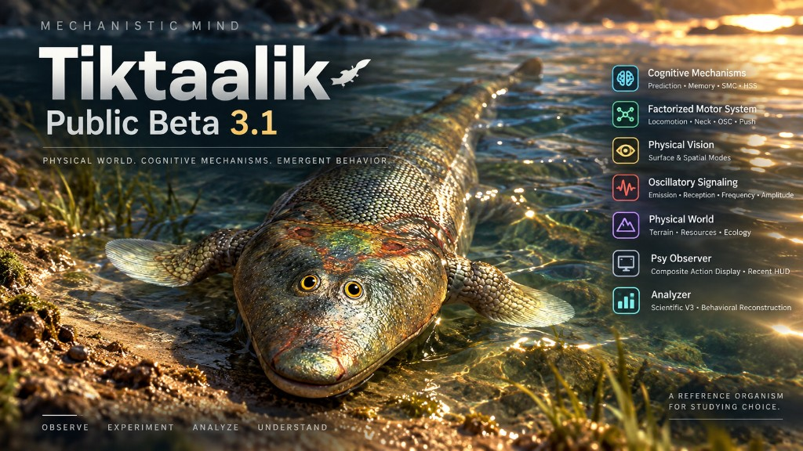

# Mechanistic Mind 1.0 — Tiktaalik (Public Beta 3.1)



**Mechanistic Mind** is an experimental artificial-life / mechanistic simulation
environment. Observed behavioral structure should be treated as experimental
evidence requiring controlled comparison and ablation, not as evidence of
human-like cognition or subjective experience.

Do **not** treat observed behavior as proof of consciousness, intention,
recognition, communication, language, attention, learning, intelligence, or
goal-directed seeking.

| Identity | Value |
|----------|-------|
| Model | Mechanistic Mind 1.0 — Tiktaalik |
| Release | Public Beta 3.1 |
| Public Observer | Psy Observer Web 0.2.0 |
| Runtime | TwoAgentRuntime (recommended first run) |
| Public preset | TIKTAALIK_BETA31 |

Public Beta 3.1 includes the Beta 3 two-agent Observer cut plus factorized
composite motors (NECK / OSC / PUSH), canonical TIKTAALIK_BETA31 configuration,
Observer composite action display, and a RECENT side-channel HUD. Frozen Public
Beta 3 remains a separate package (`RELEASE_NOTES_BETA3.md`).

See `RELEASE_NOTES_BETA31.md` and `KNOWN_LIMITATIONS.md`.

---

## RECOMMENDED FIRST RUN (Public Beta 3.1)

This is the recommended Beta 3.1 **baseline workflow**. It is not a claim of
optimal behavior.

1. **Apply** the Observer preset **MM 1.0 — Tiktaalik Beta 3.1**
   (`TIKTAALIK_BETA31`) with **Apply & Reset World** **before Play**. That yields
   the recommended **TwoAgentRuntime**. Play without Apply still uses a
   single-agent runtime.
2. Leave **PSC OFF** and **Climate Control OFF** unless you intend that
   experiment.
3. Public motor-resolution for this preset is **LOCO_FACTORIZED** (factorized
   composite). Do not silently substitute another mode.
4. Footer **primary** badge = current published composite motor. **RECENT** =
   recently applied NECK / OSC / PUSH components (about 1 s wall-clock), not the
   current motor.
5. OSC is physical oscillatory emission/reception, not communication.

The frozen Public Beta 3 first-run (OBSERVED_COMPOSITE, enable PSC ~tick 1000)
is documented in `RELEASE_NOTES_BETA3.md`.

**Why PSC begins OFF:** the recommended run first allows a history of physical /
sensorimotor consequences to accumulate before prospective scenario competition
is enabled.

**Do not reset** history / cognition / body if you later enable PSC in the same
biography.

---

## Before starting a research run (pre-run checklist)

Verify the **effective** experiment state before a long run. UI labels and the
last form you filled in are not a substitute for checking runtime/status after
Apply / Reset. This is a **recommended research workflow**, not the only valid
way to use Mechanistic Mind. It does **not** change the canonical public preset
`TIKTAALIK_BETA31`.

### 1. Vision configuration

In the current Beta 3.1 Observer, vision settings **may reset or return to a
different / default configuration** during some configuration and reset
workflows. This is a known limitation; it is planned to be improved in a future
version. See `KNOWN_LIMITATIONS.md`.

After **Apply** or **Reset**, and **before** beginning a long run, open the
**Vision** tab and confirm that the live state matches the experiment you
intend. Check, as applicable:

- Vision enabled
- Range
- Surface discrimination mode
- Optical mapping
- Spatial Vision mode
- FOV / effective vision status

No single vision configuration is universally correct. For a research run,
choose the configuration the experiment requires and verify that the **runtime**
reflects it.

### 2. PSC motor resolution

PSC motor resolution is **not** cosmetic UI. It selects the effective motor-
resolution mode used when PSC runs.

Before starting a **PSC** experiment, verify:

**PSC MOTOR RESOLUTION = OBSERVED COMPOSITE**

(`OBSERVED_COMPOSITE` — the observed-composite resolution.) Confirm this on the
effective / status side after configuration, not only on a control that may
have been overwritten.

PSC does **not** need to be enabled from tick 0. The usual research sequence is
to accumulate physical / sensorimotor history first, then enable PSC **without**
resetting that history, and to confirm observed-composite resolution at enable
time.

The public Beta 3.1 baseline preset remains `TIKTAALIK_BETA31` with
`LOCO_FACTORIZED` and PSC off. Use observed-composite when **that** is the
experiment, and verify it before a long PSC run.

### Recommended research workflow

1. Configure the experiment (preset, seed, map, agents, mechanisms).
2. Apply / Reset as intended, then **re-check the Vision tab** (enabled, range,
   surface discrimination, optical mapping, Spatial Vision, FOV / effective
   status).
3. Verify intended mechanisms and ablations.
4. Keep **Climate Control OFF** unless you are specifically studying climate.
5. Keep legacy **Experimental Signal OFF** unless you are specifically studying
   that path. **OSC** (physical oscillatory signaling) is separate from legacy
   Experimental Signal; do not treat them as the same control.
6. Allow the organism to accumulate experience / history before enabling PSC
   (PSC need not start at tick 0).
7. When enabling PSC, verify **PSC MOTOR RESOLUTION = OBSERVED COMPOSITE** if
   that is the intended resolution for the run.
8. Check runtime / status indicators once more before committing to a long run.

---

## Quick start

Unpack the archive, then launch Psy Observer. You do not need a port number or
the Python module name for normal use.

| Platform | Launcher | This packaging environment |
|----------|----------|----------------------------|
| **Linux** | `./launch_psy_observer.sh` or `./PsyObserver` | **TESTED** (bootstrap + Observer) |
| **macOS** | double-click `launch_psy_observer.command` | **STATICALLY AUDITED** (not executed here) |
| **Windows** | double-click `launch_psy_observer.bat` or `.cmd` | **STATICALLY AUDITED** (not executed here) |

Requirements:

- System Python **≥ 3.11** on PATH (used to create `.venv_psy_web` on first launch)
- Network on **first** launch (`pip install -r requirements-observer.txt`)
- Production UI is already in `mechanistic_mind/ui/psy_observer_web/web_dist/`
  (Node/npm is **not** required for normal use)

First launch may take a few minutes while `.venv_psy_web` is created.

Later launches reuse that environment.

The launcher binds **127.0.0.1** and prefers port **8768**, falling back to a
free port if 8768 is occupied. It opens a local browser when ready. Closing the
browser does **not** stop a running experiment.

Stop with **Quit** in the small ownership window, Ctrl+C in the launcher
terminal, or `./launch_psy_observer.sh --quit`.

On macOS, first open may need **right-click → Open** if Gatekeeper quarantines
the `.command` file. Homebrew is not required.

On Windows, WSL is not required. If Python is missing, the window stays open
with an error.

Manual equivalent after the environment exists:

```bash
PYTHONPATH=. .venv_psy_web/bin/python -m mechanistic_mind.ui.psy_observer_web
```

Rebuild the UI only if you change frontend sources:

```bash
cd web/psy-observer && npm install && npm test && npm run build
```

### New-user path

unpack → launch → bootstrap if required → Psy Observer opens → Apply & Reset
World with **Tiktaalik Beta 3.1** (`TIKTAALIK_BETA31`) → Play → Pause →
Analyze Current → Save & Stop → reopen/restore a saved run.

Results are written under **project-relative**
`results/psychology_observer/psy_observer_web/` (the package root, not the
caller's working directory). Saved runs are `psyweb-*` directories. Live
staging uses `.live-*` until a successful Save & Stop.

---

## Observer workflow

**Transport:** Play / Pause / Step / Stop / Reset.

**Execution (wall-clock only; scientific `dt` unchanged):** REALTIME (LIVE) /
FAST / MAX / HEADLESS.

**Observer detail:** MINIMAL / NORMAL / FULL — how much the human UI captures,
not agent memory.

**Evidence:** FULL SCI writes Scientific V3 JSONL. Compact evidence modes reduce
what is stored; they do not change physics.

**Experiment:** seed, map size, ecology preset, two-agent, mechanisms, Apply &
Reset World vs Apply Live.

**Predictive / PSC:** Experiment → Predictive. PSC enable/disable is a live
mechanism toggle. Beta 3.1 public preset uses `LOCO_FACTORIZED`. `OBSERVED_COMPOSITE`
remains available. Footer RECENT is Observer-only UX for short-lived side-channel
motors.

**FOV / vision overlays:** Observer visualization of optical exposure. Not
equivalent to agent-accessible observation.

**Analyze Current:** paused reconstruction of recorded Scientific V3 into
TickStories / Behavioral Reconstruction. HTTP stays compact.

**Save & Stop:** asynchronous snapshot publish. Failure should leave live state
retryable.

**Restore:** reopen a saved `psyweb-*` run and continue ticks from the published
snapshot.

### Four layers (do not collapse them)

| Layer | What it is |
|-------|------------|
| Simulation state | Bodies, world, cognition stores at a tick |
| Scientific evidence | Recorded receipts (O→D→M→C, pose, signals, contacts) |
| Observer visualization | Human overlays, FOV, terrain paint |
| Analyzer-derived reconstruction | TickStories, episodes, derived metrics |

Observer overlays are not agent-accessible merely because humans can see them.

---

## Scientific evidence / Analyzer

Scientific V3 core chain:

**Observation → Decision → Motor → Consequence**

Analyzer Next reconstructs TickStories and behavioral episodes from recorded
evidence. FULL coverage requires successful consumption of that history, not
metadata that rows exist.

**Observed / recorded:** physical observations, DecisionReceipts, MotorReceipts,
ConsequenceReceipts, pose/geometry where recorded, signals, visual exposure,
contacts.

**Derived (explicitly labeled):** approach / withdrawal candidates, geometric
relationships, motor reversals, sensorimotor trend-reversal candidates, other
derived metrics.

**Not established merely by observation:** recognition, communication,
intention, wanting, deliberate navigation, learning.

Physical signaling is not automatically communication.
Distance reduction is not automatically seeking.
Terrain-assisted displacement is not automatically intentional terrain use.

---

## Configuration note

Low-level `CognitionConfig` still defaults `psc_motor_resolution` to
`LOCO_FACTORIZED`. Fresh Observer experiments using **TIKTAALIK_BETA31** set
two-agent mode and `LOCO_FACTORIZED`, with PSC and Climate Control off. Applying
a custom experiment without the preset does **not** silently migrate motor
resolution.

Default session Play without Apply still constructs a single-agent runtime.
Use Apply & Reset World with Tiktaalik Beta 3.1 for the recommended two-agent
first run.

---

## Tests (developers)

```bash
PYTHONPATH=. python3 -m pytest tests/test_analyze_current_paused_v3.py \
  tests/test_save_stop_enospc_retry.py \
  tests/test_beta3_recommended_public_preset.py \
  tests/test_p0_cognition_indexes.py \
  tests/test_psy_observer_save_stop.py -q
```

GIT_PUSH is not part of this release process.
